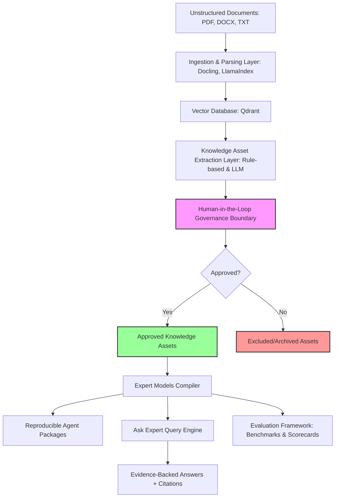

# ExpertMachina Architecture

ExpertMachina is architected as a multi-layered knowledge pipeline designed to transform raw, unstructured enterprise documents into structured, governed, and highly auditable agent packages.

---

## 1. Ingestion & Parsing Layer
- **File Handling**: Supports PDF, DOCX, and TXT files. Raw files are uploaded to the `uploads/` directory, scoped securely by workspace/project.
- **Parsing Engines**:
  - **Docling**: Performs deep layout analysis, extracts structured sections, tables, headers, and body text.
  - **LlamaIndex**: Drives the chunking hierarchy and metadata annotation structure.
- **Mock Fallback Logic**: To ensure out-of-the-box operation and continuous integration testing, if no live LLM or API keys are available, a robust mock generator handles native text parsing and embeds mock vectors locally.

## 2. Vector Indexing & Storage
- **Qdrant DB**: A local, file-based vector database stored in `backend/qdrant_db/`. Holds vector representations of all parsed document chunks.
- **Metadata Tagging**: Every chunk in Qdrant is tagged with structural context, such as its source document ID, section title, page range, and cryptographic content hashes.

## 3. Knowledge Asset Extraction Layer
This layer transforms raw text chunks into governed business facts, system descriptions, procedures, and rules.
- **Rule-Based Extractors**: Parses structured text blocks matching known syntax pattern indicators (e.g. "SOP-", "Policy:", "Procedure:").
- **LLM-Assisted Extractors**: Synthesizes unstructured blocks into clean knowledge payloads containing names, descriptions, priorities, and conditions.
- **Quality Score Engine**: Validates every extracted asset against a multi-criteria scoring algorithm:
  - **Freshness**: Tracked via timestamps.
  - **Verification**: Ratio of source citation mapping.
  - **Conflict Index**: Cross-references overlapping assertions across the database.

## 4. Human-in-the-Loop Governance Boundary
The core differentiator of ExpertMachina. No automated extraction is allowed to exit the factory boundary directly.
- **Asset Review Queue**: A dedicated dashboard for operators to approve, reject, or archive candidate knowledge assets.
- **Audit Ledger**: A write-only, append-only database table (`audit_events`) logging every state transition, operator ID, and validation success or bypass blockage event.

## 5. Expert Model Compiler & Packaging
- **Expert Models**: Groups of logically related and strictly `APPROVED` assets.
- **Agent Package Compiler**: Bundles selected Expert Models into standardized, versioned zip/json manifests.
- **Manifest Reproducibility**: Enforces deterministic, lexicographical sorting of assets inside the payload schema. Ensures that compile runs from identical inputs yield identical, bitwise-reproducible distribution bundles.
- **Serialization**: Encodes full provenance trace strings and digital integrity checks directly inside the distributable package.

## 6. Ask Expert Query Engine (MVP 0.3)
The interactive, evidence-backed query layer. Unlike standard RAG, the retrieval boundary is scoped to a single selected Expert Model:
- **Approved Asset Retrieval**: Vector similarity search restricted to assets bundled in the chosen Expert Model, enforced at both the SQLite and Qdrant layers.
- **Evidence Validation Engine**: Pre-generation gate verifying each candidate asset's `APPROVED` status, `source_hash` integrity (tamper detection), and complete provenance metadata. Failures are discarded and audit-logged.
- **Grounded Answer Generation**: The generation prompt is constructed strictly from validated evidence.
- **Answer Verification Engine**: Post-generation claim extraction and evidence mapping. Answers below the coverage threshold are blocked and replaced with `INSUFFICIENT EVIDENCE`.
- **Query Telemetry**: Every query is recorded in the audit ledger with retrieved asset IDs, evidence hashes, answer hash, operator, and timestamp.

See [assurance.md](assurance.md) for the verification thresholds and scoring model.

## 7. Evaluation Framework (MVP 0.4)
Quantifies trust in an Expert Model through reproducible benchmark runs:
- **Benchmark Datasets**: Per-project question sets with expected claims, expected answer type (`FACTUAL`/`PROCEDURAL`/`POLICY`/`REFUSAL`), minimum coverage, and citation requirements.
- **Snapshot-Based Batch Engine**: Each evaluation run freezes the Expert Model's approved asset IDs and hashes plus the benchmark question set at creation time, so results are reproducible regardless of later governance changes.
- **Scorecard Metrics**: Per-run `pass_rate`, average coverage and confidence scores, and per-question results including unsupported claims and citations.
