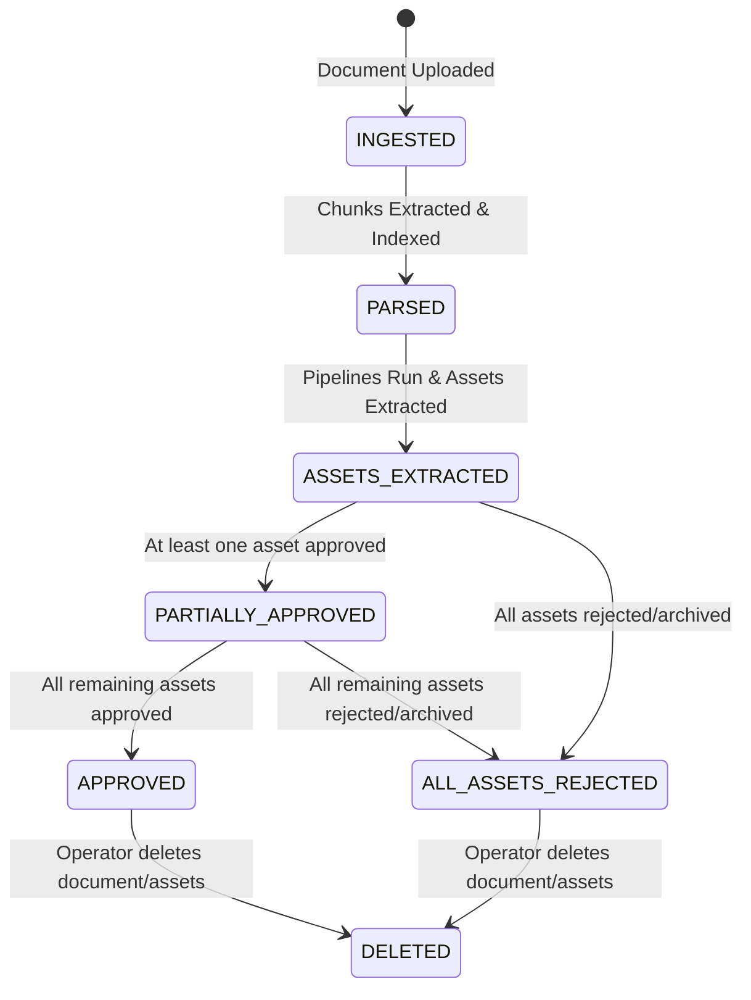

# Knowledge Governance & Lifecycle Control

ExpertMachina enforces an enterprise-grade governance model where knowledge assets and source documents are tracked using a strict state-machine engine. This ensures that unverified, outdated, or explicitly rejected knowledge never enters downstream AI production systems.

---

## 0. Core Governance Principles

These principles are load-bearing — every workflow below derives from them:

1. **Only `APPROVED` knowledge crosses the governance boundary.** Enforced in the backend, never just the UI.
2. **Approved knowledge is never edited in place.** Edits create `CANDIDATE` revisions that supersede through re-review (immutable revision history).
3. **Governance verdicts are content-bound.** A human review pertains to *Asset A Revision X vs Asset B Revision Y* — not to *Asset A forever*. When an asset's content changes through an approved revision, conflict verdicts involving that asset are automatically invalidated and re-judged; verdicts on unrelated pairs survive. Without this rule, a stale dismissal could silently waive a brand-new contradiction.
4. **Missing data is reported as missing, never fabricated.** Citations, provenance, and trust components show `null` / `NOT_MEASURED` rather than invented defaults.
5. **Detection without enforcement is advisory, not governance.** Unresolved semantic conflicts block package compilation; publication is itself a governance event whose gate verdict is permanently recorded.
6. **Every score must be explainable.** Conflict and trust scores carry full per-component breakdowns and reasons — "why not 100?" is always answerable from the data, and scorers record their version and (for model-based verdicts) the exact model weights hash.

---

## 1. Document Lifecycle States

Source documents transition through the following lifecycle states:

- **`INGESTED`**: The raw file is uploaded.
- **`PARSED`**: The text content is successfully parsed, split into structural chunks, and vector-indexed.
- **`ASSETS_EXTRACTED`**: The candidate knowledge assets have been extracted from the chunks and placed in the review queue.
- **`PARTIALLY_APPROVED`**: A mixture of asset states exists (e.g. at least one is approved, some are pending, or others are rejected).
- **`APPROVED`**: Every extracted asset derived from this document has been explicitly marked as `APPROVED`.
- **`ALL_ASSETS_REJECTED`**: Every extracted asset derived from this document has been rejected. *Crucially, the document still exists in the system but contributes no active/governed knowledge.*
- **`DELETED`**: The document or its derived assets were explicitly hard-deleted by an operator action.

---

## 2. Governance Boundary Rules

### Rule 1: Strict Backend Enforced Inclusion
Only assets marked explicitly as `APPROVED` are allowed to enter Expert Models or Agent Packages. Attempts to bypass this check via direct API calls (`create_expert_model`) using candidate, rejected, or archived assets will result in:
- A `400 Bad Request` or `ValueError` validation error.
- An immediate block of the request transaction.
- An audit event entry logged as: `GOVERNANCE_BLOCKED_NON_APPROVED_ASSET`.

### Rule 2: Automatic Lifecycle Recalculations
Whenever an asset status is changed (Approved, Rejected, Archived, Deleted), the parent document's lifecycle state is recalculating dynamically within the database transaction.

### Rule 3: Document Inventory Exclusion
Documents that transition to `ALL_ASSETS_REJECTED` or `DELETED` states are automatically hidden from regular Document Inventory queries on both backend and frontend layers to keep the operator's workspace clean and focused only on active knowledge.

---

## 3. Operator Usability & Workflow Controls (P1-P5)

To optimize governance workflows for high-throughput environments, the platform implements five core workflow features:

* **P1 & P3: Approve All Candidates**: Adds a bulk action button to approve all pending candidates with a single backend database transaction.
* **P2: Document Extraction State Transition Patch**: Solves issues where documents remained stuck in the `PARSED` status even after extraction pipelines created assets.
* **P4: Deletion Confirmation Safeguards**: Integrates modal dialog verification steps on the frontend to prevent accidental destruction of parsed datasets.
* **P5: Hotkey Acceleration**: Enforces global keyboard listeners on the review queue:
  - Pressing `A` automatically approves the first pending asset card.
  - Pressing `R` automatically rejects the first pending asset card.
